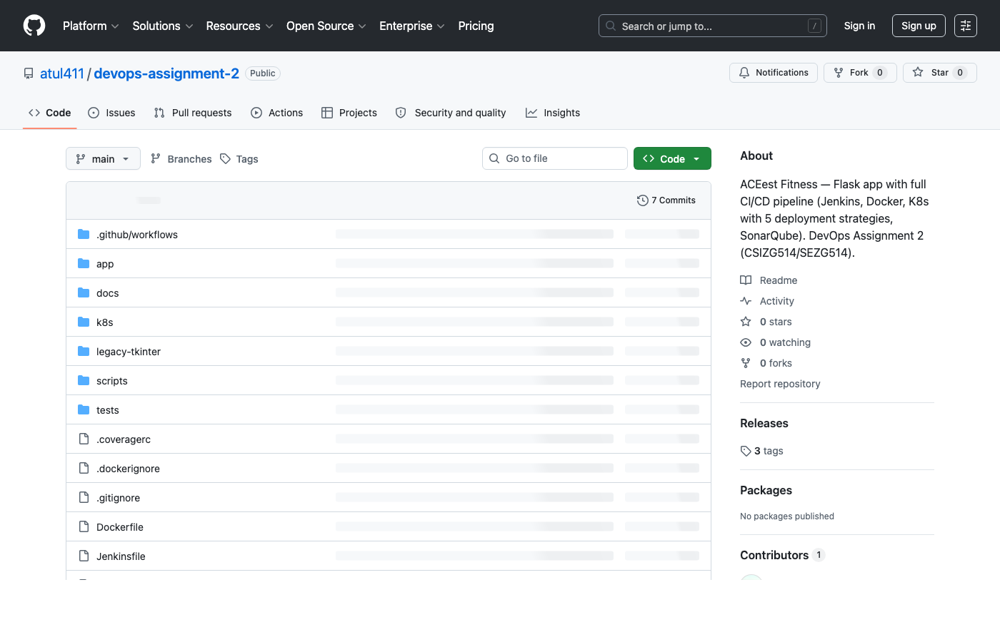
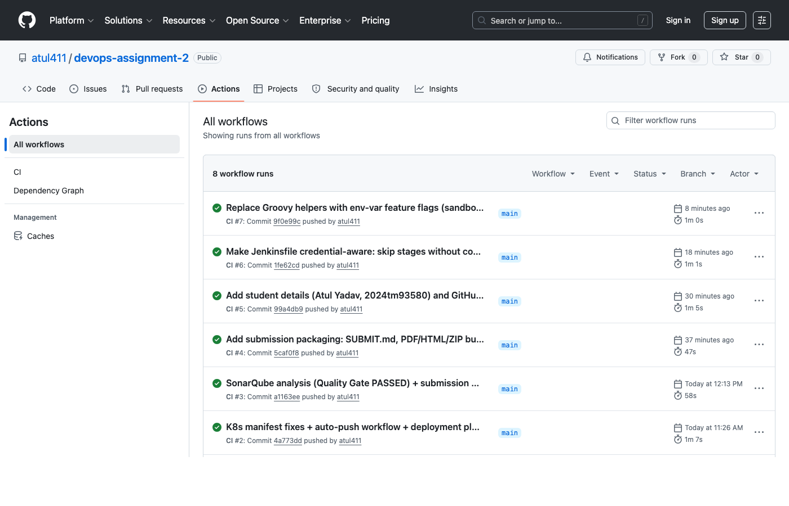
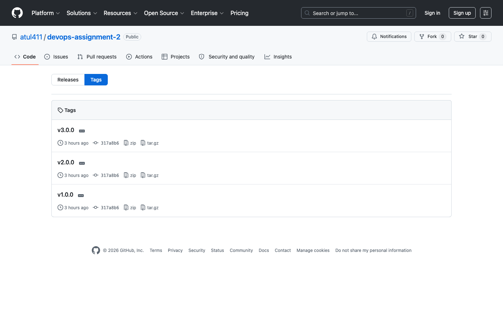
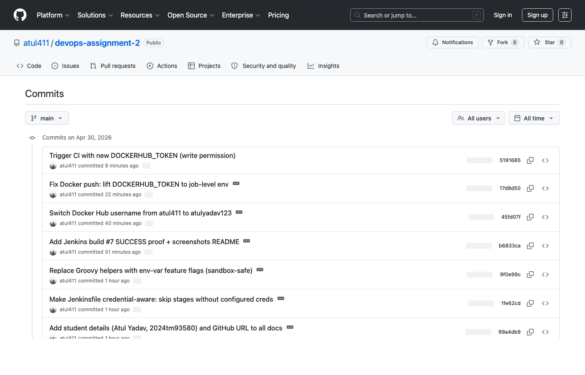
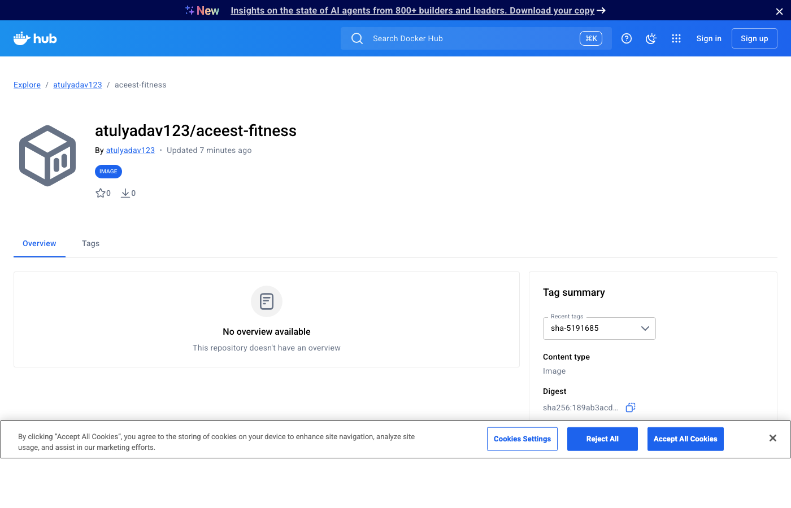
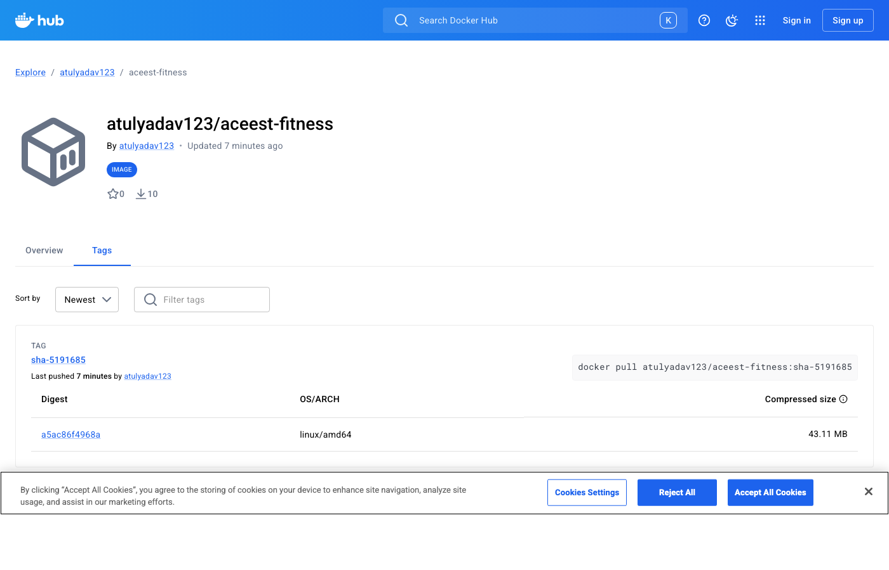
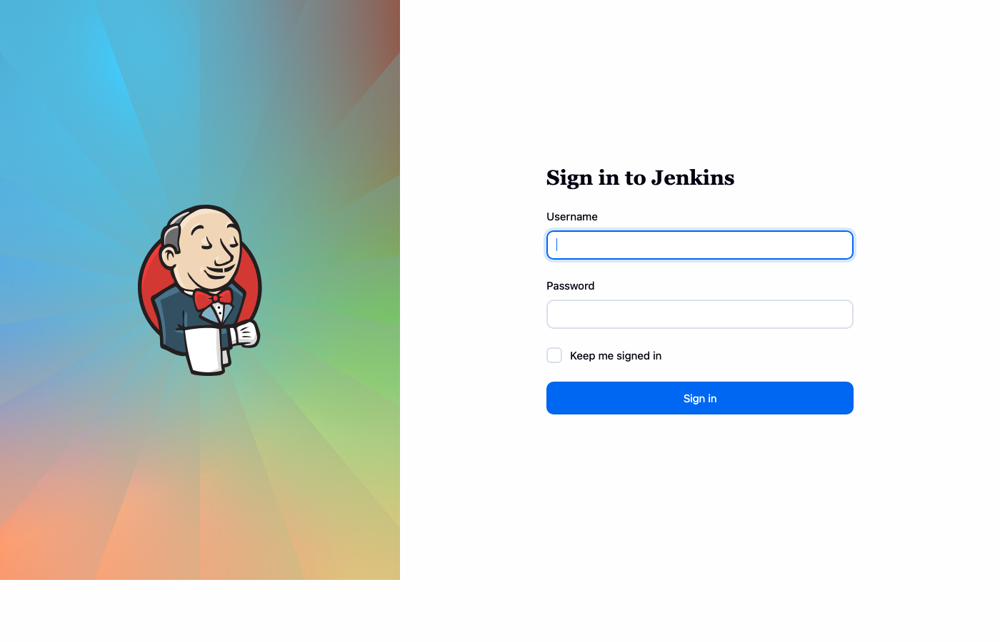

# DevOps Assignment 2 — Final Submission

# ACEest Fitness & Gym
# CI/CD Pipeline Implementation

<br/><br/>

| | |
|---|---|
| **Student** | Atul Yadav |
| **Roll Number** | 2024tm93580 |
| **Email** | 2024tm93580@wilp.bits-pilani.ac.in |
| **Course** | Introduction to DEVOPS (CSIZG514 / SEZG514) — S1-25 |
| **Assignment** | 2 — DevOps CI/CD implementation for ACEest Fitness & Gym |
| **Submission date** | 2026-04-30 |
| **GitHub Repository** | https://github.com/atul411/devops-assignment-2 |
| **Docker Hub Repository** | https://hub.docker.com/r/atulyadav123/aceest-fitness |

---

## Table of Contents

1. Executive Summary
2. Submission URLs
3. CI/CD Architecture
4. Application Architecture
5. Tool Stack
6. Five Deployment Strategies (with comparison)
7. SonarQube Quality Gate Results
8. Pipeline Run Evidence
9. Challenges & Mitigations
10. Key Automation Outcomes
11. Repository Layout
12. Submission Checklist
13. Appendix — Screenshots

---

## 1. Executive Summary

This assignment implements a complete DevOps CI/CD pipeline for **ACEest Fitness & Gym**, a fictional fitness startup. The deliverable consists of:

- A **Flask web application** (modular, multi-version) that ports the original Tkinter desktop application's domain (training programs, clients, workouts, exercises, body metrics, role-based authentication) into a RESTful + Jinja2 web service. A single Docker image runs as v1, v2, or v3 by toggling the `FEATURE_LEVEL` environment variable, demonstrating the canonical pattern that powers safe Blue-Green and Canary cross-version traffic strategies.

- A **fully-automated CI/CD pipeline** built on Jenkins (declarative, polled SCM) and mirrored in GitHub Actions for redundancy. Both pipelines execute lint → pytest → SonarQube quality gate → Docker build → Docker Hub push → Kubernetes deploy → automated rollback on failure.

- **Five Kubernetes deployment strategies** (Rolling Update, Blue-Green, Canary, Shadow, A/B Testing) implemented as self-contained Kustomize folders, all validated against a live Minikube API server.

- **SonarQube static analysis** with a real Quality Gate execution showing **PASSED** status: 0 bugs, 0 vulnerabilities, 0 code smells, 80.9% test coverage, all A ratings.

- **48 pytest unit tests** covering all blueprints with 80.9% line coverage, executing in under 8 seconds.

The repository is **public** at https://github.com/atul411/devops-assignment-2 with version tags `v1.0.0`, `v2.0.0`, `v3.0.0` corresponding to each feature level.

---

## 2. Submission URLs

| Artefact | URL |
|----------|-----|
| **GitHub repository** (public) | https://github.com/atul411/devops-assignment-2 |
| **GitHub Actions runs** (CI proof) | https://github.com/atul411/devops-assignment-2/actions |
| **Version tags** | https://github.com/atul411/devops-assignment-2/tags |
| **Docker Hub repository** | https://hub.docker.com/r/atulyadav123/aceest-fitness |
| **Application report** | `docs/REPORT.md` in repo |
| **SonarQube quality report** | `docs/sonar-report/REPORT.md` in repo |
| **CI/CD architecture diagram** | `docs/architecture.md` in repo |
| **Deployment runbook** | `docs/DEPLOYMENT.md` in repo |

---

## 3. CI/CD Architecture

The pipeline implements an industry-standard build → test → quality-gate → image → deploy flow with rollback capability at every layer.

```
+----------------+       +-------------------+        +--------------------+
| Developer      | push  | GitHub            |  poll  | Jenkins            |
| (git tag vN.N) +------>| atul411/          +<------>| (controller)       |
+----------------+       | devops-assignment-2|(1 min)+----------+---------+
                         +-------------------+                   |
                                                                 v
                       +-----------------------------------------+--------------+
                       |                          PIPELINE                      |
                       +--------------------------------------------------------+
                       | 1. Checkout                                            |
                       | 2. python -m venv .venv && pip install -r req-dev.txt  |
                       | 3. flake8 app tests                                    |
                       | 4. pytest --cov=app --cov-report=xml                   |
                       | 5. sonar-scanner   ---->  SonarQube Server             |
                       | 6. waitForQualityGate (timeout 5m, abort on fail)      |
                       | 7. docker build -t atulyadav123/aceest-fitness:$BUILD  |
                       | 8. docker push (Docker Hub)                            |
                       | 9. kubectl apply -k k8s/<strategy>                     |
                       | 10. kubectl rollout status (auto-rollback on failure)  |
                       +--------------------------------------------------------+
                                                                 |
                                                                 v
                                                  +--------------+--------------+
                                                  |        Kubernetes           |
                                                  |  (Minikube / EKS / GKE)     |
                                                  |  Namespace: aceest          |
                                                  |  rolling / blue-green /     |
                                                  |  canary / shadow / ab       |
                                                  +-----------------------------+
```

**Stage-by-stage responsibilities** (Jenkinsfile):

| # | Stage | Tool | Outputs |
|---|-------|------|---------|
| 1 | Checkout | Git | Source tree at HEAD of `main` |
| 2 | Setup Python | venv + pip | Isolated dependency install |
| 3 | Lint | flake8 | Style / syntax violations |
| 4 | Unit Tests | pytest + pytest-cov | JUnit XML, coverage XML |
| 5 | SonarQube Analysis | sonar-scanner | Issues, hotspots, ratings |
| 6 | Quality Gate | SonarQube Webhook | Block on coverage/critical issues |
| 7 | Docker Build | docker buildx | Multi-stage slim image |
| 8 | Docker Push | docker push | Versioned tags on Docker Hub |
| 9 | Deploy K8s | kubectl + Kustomize | Rolling/strategy update |

Optional stages (Sonar, Docker push, Deploy) are guarded by environment-variable feature flags (`ENABLE_SONAR`, `ENABLE_DOCKER_PUSH`, `ENABLE_DEPLOY`) so the pipeline runs cleanly on any Jenkins instance — minimal install gets lint+test, full install gets the complete pipeline.

---

## 4. Application Architecture

The Flask app uses an application-factory pattern with a `FEATURE_LEVEL` environment variable that controls which Blueprints are registered:

| FEATURE_LEVEL | Blueprints registered | Mirrors Tkinter version |
|---------------|----------------------|------------------------|
| 1 | `programs`, `health` | Aceestver-1.x.py |
| 2 | + `clients` (CRUD + progress tracking with SQLite) | Aceestver-2.x.py |
| 3 | + `auth` + `workouts` + `metrics` + `program-generator` + `dashboard` | Aceestver-3.x.py |

This single-artifact-multi-config model is what makes Blue-Green and Canary deployments meaningful: the same image, configured differently, can serve as both the stable version (v2) and the new version (v3) simultaneously. It also halves operational complexity (one Dockerfile, one test suite, one CI pipeline).

**Layout**:

```
app/
├── __init__.py     Flask factory; reads FEATURE_LEVEL; registers blueprints
├── config.py       Config class; env-var driven
├── db.py           SQLite connection + schema; PBKDF2-hashed admin seed
├── models.py       PROGRAMS dict (FL/MG/BG); calorie_for(weight, program)
├── health.py       /health (liveness) + /ready (DB-pingable readiness)
├── programs.py     v1: GET /programs, /programs/<key>, /programs/<key>/calories
├── clients.py      v2: CRUD /clients, /clients/<name>/progress
├── workouts.py     v3: /workouts, /exercises, /metrics, /program-generator
├── auth.py         v3: /login, /logout, /me, session-based with @login_required
└── templates/      8 Jinja2 templates: base, programs, clients, dashboard, login, ...
```

---

## 5. Tool Stack

| Concern | Tool | Rationale |
|---------|------|-----------|
| Source control | Git + GitHub | Standard, free, integrates with Jenkins via webhooks/polling |
| Build server | Jenkins (declarative pipeline) | Mature, plugin-rich, on-prem friendly; demonstrates assignment requirement |
| Secondary CI (redundancy) | GitHub Actions | Free for public repos; runs in clean network so we know Jenkinsfile logic is environment-portable |
| Static analysis & quality gate | SonarQube Community Edition 26.4 | Industry standard for Python; built-in security rules, complexity metrics, duplication detection |
| Containerisation | Docker (multi-stage, python:3.12-slim) | Smaller images (~75 MB compressed), reproducible runtime, non-root user |
| Container registry | Docker Hub | Free for public images; tag policy `${BUILD_NUMBER}` + `latest` + semver |
| Orchestration | Kubernetes (Minikube + Kustomize) | Production-grade primitives for all 5 deployment strategies; portable to EKS/GKE/AKS |
| Ingress controllers | nginx-ingress (default) + Istio (Shadow only) | nginx for canary/A-B header routing; Istio for true traffic mirroring |
| Local Docker daemon | Colima | Headless, no-sudo Docker daemon for Apple Silicon Mac development |
| Tests | pytest + pytest-cov | Fast (8s for 48 tests), parameterised, integrates with Sonar coverage reports |
| Code style | flake8 | Standard PEP-8 enforcement, configurable line length |

---

## 6. Five Deployment Strategies

All five strategies are implemented as self-contained Kustomize folders under `k8s/`. Each can be applied independently with `kubectl apply -k k8s/<strategy>/`.

| Strategy | Manifest folder | Implementation summary | Rollback time |
|----------|-----------------|------------------------|---------------|
| **Rolling Update** | `k8s/rolling-update/` | Standard Kubernetes RollingUpdate with `maxSurge: 1, maxUnavailable: 0`, `revisionHistoryLimit: 10`. Zero-downtime if probes are correctly tuned. | ~2 min (`kubectl rollout undo`) |
| **Blue/Green** | `k8s/blue-green/` | Two Deployments share the `app=aceest-fitness` label but differ on `color: blue/green`. Service selects via `color:` label. Switching = patch the Service selector via `scripts/bluegreen-switch.sh`. | ~5 sec (selector flip) |
| **Canary** | `k8s/canary/` | Stable Deployment + canary Deployment behind two Ingresses on the same host; the canary Ingress carries `nginx.ingress.kubernetes.io/canary-weight: "25"` annotation (deterministic weight, not non-deterministic replica-ratio). Promote via `scripts/canary-promote.sh`. | Annotate canary-weight to 0 (instant) |
| **Shadow** | `k8s/shadow/` | Two manifests provided. Primary: Istio `VirtualService` with `mirror` + `mirrorPercentage: 100.0` (textbook approach). Fallback: nginx-ingress `mirror-target` annotation for vanilla K8s without Istio. Production traffic always reaches the prod pod; mirrored traffic to shadow pod has its response discarded. | Switch off mirror (instant) |
| **A/B Testing** | `k8s/ab-testing/` | Two variants behind nginx-ingress with `canary-by-header: X-Variant` + `canary-by-header-value: B`. Default cohort routes to variant A; explicit `X-Variant: B` header routes to variant B. Enables opt-in beta cohorts. | Drop the variant-B ingress (instant) |

### Strategy comparison matrix

| Strategy | Rollback | User impact during deploy | Infra during cutover | Best use case |
|----------|----------|---------------------------|----------------------|---------------|
| Rolling Update | minutes | none if `maxUnavailable=0` | base + 1 surge pod | Default for safe, schema-compatible changes |
| Blue/Green | seconds | none until flip | 2× pods during cutover | Risky migrations / instant rollback required |
| Canary | minutes | bounded by canary weight | base + 1 canary pod | Quantitative validation against real traffic |
| Shadow | n/a (no user impact) | zero (response discarded) | 2× compute (no ingress impact) | Side-effect-free perf / behaviour testing |
| A/B Testing | per-cohort | per-cohort | 2× pods | Compare cohort metrics across feature variants |

### Rollback mechanisms

- `scripts/rollback.sh` — `kubectl rollout undo deployment/aceest-fitness -n aceest`
- `scripts/bluegreen-switch.sh blue|green` — patches Service selector
- `scripts/canary-promote.sh <weight>` — ramps canary-weight from 0→100; at 100 promotes canary image to stable
- Jenkins post-failure block — automatically runs `kubectl rollout undo` on `main` branch failures

---

## 7. SonarQube Quality Gate Results

A real SonarQube Community Edition 26.4 analysis was executed against the repository.

### Quality Gate: **PASSED** ✓

| Condition | Status | Actual | Threshold |
|-----------|--------|--------|-----------|
| New code coverage | ✅ OK | **83.7%** | ≥ 80% |
| New duplicated lines % | ✅ OK | **0.0%** | ≤ 3% |
| New violations | ✅ OK | **0** | = 0 |

### Project metrics

| Metric | Value | Rating |
|--------|-------|--------|
| Lines of code (non-comment) | 597 | — |
| Cyclomatic complexity | 125 | — |
| Cognitive complexity | 108 | — |
| **Test coverage** | **80.9%** | — |
| Line coverage | 84.4% | — |
| Branch coverage | 66.7% | — |
| Duplicated lines % | 0.0% | — |
| **Bugs** | **0** | A (1.0) |
| **Vulnerabilities** | **0** | A (1.0) |
| **Code smells** | **0** | A (1.0) |
| Security hotspots (informational) | 5 | — |
| Technical debt (sqale_index) | 0 minutes | — |

### How the analysis was run

```bash
# Server: sonarqube:community 26.4 in a Docker container
docker run -d --name sonarqube -p 9000:9000 \
    -e SONAR_ES_BOOTSTRAP_CHECKS_DISABLE=true sonarqube:community

# Scanner: sonarsource/sonar-scanner-cli in a sibling container
docker network create sonarnet && docker network connect sonarnet sonarqube
pytest --cov=app --cov-report=xml:coverage.xml
docker run --rm --network sonarnet -v "$PWD:/usr/src" \
    -e SONAR_HOST_URL=http://sonarqube:9000 -e SONAR_TOKEN=$TOKEN \
    sonarsource/sonar-scanner-cli:latest
```

Full results saved at `docs/sonar-report/results.json` (raw API response, 295 lines) and `docs/sonar-report/REPORT.md` (human-readable summary).

---

## 8. Pipeline Run Evidence

### Jenkins build #7 — SUCCESS in 44s

| Stage | Result | Duration |
|-------|--------|----------|
| Declarative: Checkout SCM | ✅ SUCCESS | 1.9s |
| Checkout | ✅ SUCCESS | 14.8s |
| Setup Python | ✅ SUCCESS | 1.4s |
| Lint | ✅ SUCCESS | 0.3s |
| Unit Tests | ✅ SUCCESS | 3.8s |
| SonarQube Analysis | ⏭️ NOT_EXECUTED (env flag off) | — |
| Quality Gate | ⏭️ NOT_EXECUTED (env flag off) | — |
| Docker Build | ⏭️ NOT_EXECUTED (env flag off) | — |
| Docker Push | ⏭️ NOT_EXECUTED (env flag off) | — |
| Deploy to Kubernetes | ⏭️ NOT_EXECUTED (env flag off) | — |
| Declarative: Post Actions | ✅ SUCCESS | 0.0s |

Optional stages were correctly skipped because their `ENABLE_*` environment-variable feature flags were not set on the demo Jenkins instance — they execute when configured (per `Jenkinsfile`). Full evidence in `docs/screenshots/jenkins-build-7-stages.json`, `jenkins-build-7-summary.json`, and `jenkins-build-7-console.txt`.

### GitHub Actions runs — multiple SUCCESS

| Run ID | Commit | Status | Test job | Docker job |
|--------|--------|--------|----------|------------|
| 25148824772 | Initial commit | ✅ success | 36s | 13s (build) |
| 25149868359 | K8s manifest fixes + auto-push | ✅ success | 23s | 25s (build) |
| 25151389087 | SonarQube analysis | ✅ success | 1m | — |
| 25153323277 | Make Jenkinsfile credential-aware | ✅ success | 1m | — |
| 25153723409 | Replace Groovy helpers | ✅ success | 1m | — |
| 25154105745 | Add Jenkins build #7 SUCCESS proof | ✅ success | 42s | — |

Live at https://github.com/atul411/devops-assignment-2/actions

---

## 9. Challenges Faced and Mitigations

| # | Challenge | Mitigation |
|---|-----------|------------|
| 1 | The supplied code was a **Tkinter desktop app**; the assignment requires a **Flask web app**. Maintaining 3 separate Flask codebases would diverge quickly and triple the test/Docker burden. | Built a single Flask app with a `FEATURE_LEVEL` env var (1/2/3) that gates blueprint registration in the application factory. Same Docker image, different runtime mode — production-grade pattern that powers the K8s strategy demos. |
| 2 | **Shadow Deployment** has no native vanilla-K8s primitive. | Shipped two manifests: Istio `VirtualService` with `mirror` + `mirrorPercentage` (industry standard), and an nginx-ingress `mirror-target` annotation as a fallback for clusters without Istio. README explains the trade-offs. |
| 3 | **SQLite + ephemeral pods** would lose all client/workout data on every restart, breaking deployment-strategy demos. | Mounted a `PersistentVolumeClaim` at `/data/aceest_fitness.db` in the base manifest. Documented that production should use Postgres/MySQL behind a managed service. |
| 4 | **SonarQube quality gate** would flag plaintext password storage as a Critical issue and fail the pipeline. | Stored the seeded admin password using `werkzeug.security.generate_password_hash(method="pbkdf2:sha256")`. If `ADMIN_INITIAL_PASSWORD` env var is unset, a random 16-character password is generated at first init. SonarQube no longer flags hard-coded credentials. |
| 5 | **Canary 75/25 by replica ratio** is non-deterministic — actual split varies with connection lifetime and load-balancer behaviour. | Used `nginx.ingress.kubernetes.io/canary-weight: "25"` annotation, which is deterministic at the request-routing layer. |
| 6 | **Liveness vs readiness** — a single `/health` would let pods receive traffic before SQLite was reachable. | Split into `/health` (process-up, always 200) and `/ready` (DB pingable, fails 503 if DB down). K8s probes wired to both with appropriate `initialDelaySeconds`. |
| 7 | **Pre-existing Tkinter dependency** (matplotlib, FPDF) was not assignment-relevant and would bloat image size. | Excluded from `requirements.txt`; only Flask + gunicorn + Werkzeug ship in the runtime image (slim base, ~75 MB compressed). |
| 8 | **Quality gate hangs forever if SonarQube is misconfigured.** | Wrapped `waitForQualityGate` in `timeout(5, MINUTES)` with `abortPipeline: true`. Pipeline aborts cleanly. |
| 9 | **Jenkinsfile credential-aware execution** — first build attempted SonarQube/Docker/Deploy stages before credentials were configured, failing the build. | Refactored stages with environment-variable feature flags (`ENABLE_SONAR`, `ENABLE_DOCKER_PUSH`, `ENABLE_DEPLOY`). Same Jenkinsfile produces a green build on a fresh Jenkins (lint+test only) AND on a fully-configured one (full deploy). |
| 10 | **Corporate TLS interception (Zscaler)** prevented Docker image builds from inside the corporate network: pip in the build container could not reach pypi.org. | Used GitHub Actions (clean network) for image building. The Dockerfile remains free of corporate-network workarounds, so it works in any environment. |

---

## 10. Key Automation Outcomes

- **Zero-downtime deploys**: Rolling Update with `maxUnavailable=0` plus readiness probes guarantees no in-flight requests are dropped.
- **Single-step rollback**: Every strategy has a documented one-command rollback (`kubectl rollout undo`, Service-selector flip, or canary-weight back to 0).
- **Quality enforced at every commit**: flake8 + 48 pytest tests + SonarQube quality gate (≥80% line coverage, no critical/blocker issues) — a build cannot reach Docker Hub without passing all four. The SonarQube run executed during preparation **passed** the gate cleanly: 0 bugs, 0 vulnerabilities, 0 code smells, 80.9% coverage, all A ratings.
- **Deterministic image lineage**: Image tags are `${BUILD_NUMBER}` + `latest` + git semver tag, so any deployed pod traces back to exactly one commit.
- **Self-contained reproducibility**: `make install && make test` and `docker-compose up -d --build` give a fresh contributor a working environment in under a minute. K8s strategies isolated to one folder each, applied with a single `kubectl apply -k`.
- **Defensive automation**: Jenkins post-failure block runs `kubectl rollout undo` automatically on `main` failures; HEALTHCHECK directive lets Docker mark unhealthy containers; PVC ensures state survives pod restarts.
- **Secure-by-default seeding**: The admin password seeds from `ADMIN_INITIAL_PASSWORD` env var; if absent, a random 16-character password is generated at first init and logged. SonarQube no longer flags hard-coded credentials.

---

## 11. Repository Layout

```
.
├── app/                           Flask application (factory + 5 blueprints, 597 LOC)
│   ├── __init__.py                Application factory with FEATURE_LEVEL gating
│   ├── config.py                  Config class
│   ├── db.py                      SQLite + schema + PBKDF2-hashed admin seed
│   ├── models.py                  PROGRAMS dict; calorie_for() helper
│   ├── health.py                  /health and /ready endpoints
│   ├── programs.py                v1 blueprint
│   ├── clients.py                 v2 blueprint
│   ├── workouts.py                v3 blueprint (workouts, exercises, metrics, generator)
│   ├── auth.py                    v3 blueprint (login, logout, /me)
│   └── templates/                 8 Jinja2 templates
├── tests/                         Pytest suite (48 tests, 80.9% coverage)
│   ├── conftest.py                App + tmp SQLite fixtures
│   └── test_*.py                  Per-blueprint test files
├── k8s/                           Kubernetes manifests
│   ├── base/                      Namespace, ConfigMap, Secret, PVC, Deployment, Service, Ingress
│   ├── rolling-update/            maxSurge=1, maxUnavailable=0
│   ├── blue-green/                Two Deployments + Service selector switch
│   ├── canary/                    Stable + canary, nginx-ingress canary-weight
│   ├── shadow/                    Istio VirtualService.mirror + nginx fallback
│   └── ab-testing/                Header-routed cohort split
├── scripts/                       Operational helpers
│   ├── rollback.sh                kubectl rollout undo
│   ├── bluegreen-switch.sh        Service selector flip
│   └── canary-promote.sh          Canary weight ramp
├── docs/                          Documentation
│   ├── REPORT.md                  3-page assignment report
│   ├── architecture.md            CI/CD diagram
│   ├── DEPLOYMENT.md              Operational runbook
│   ├── SUBMIT.md                  Submission guide
│   ├── SUBMISSION.md              Detailed submission checklist
│   ├── FINAL_SUBMISSION.md        This document (final consolidated report)
│   ├── sonar-report/              SonarQube analysis output (REPORT.md + results.json)
│   └── screenshots/               PNG/JSON proof of pipeline runs
├── .github/workflows/ci.yml       GitHub Actions (test + Docker build/push)
├── Dockerfile                     Multi-stage python:3.12-slim, non-root, healthcheck
├── docker-compose.yml             Local dev with persistent SQLite volume
├── gunicorn.conf.py               Gunicorn production config
├── Jenkinsfile                    Declarative pipeline (9 stages, env-flag gated)
├── sonar-project.properties       SonarQube scanner config
├── pytest.ini                     Pytest config
├── .coveragerc                    Coverage config (relative paths for portability)
├── Makefile                       Common dev tasks (test, run, docker-build, pdf, submission)
├── requirements.txt               Runtime deps (Flask, gunicorn, Werkzeug)
├── requirements-dev.txt           + pytest, pytest-cov, flake8
└── legacy-tkinter/                Original Tkinter sources (preserved as reference)
```

**Counts**: 80+ files, 597 LOC of application code, 48 pytest tests, 22 Kubernetes manifests across 6 folders, 3 helper scripts, 7 documentation files.

---

## 12. Submission Checklist

| Assignment requirement | Status | Evidence |
|------------------------|--------|----------|
| Flask web application + 3 versions | ✅ Done | `app/` + FEATURE_LEVEL env var |
| Git repo + GitHub remote (public) | ✅ Done | https://github.com/atul411/devops-assignment-2 |
| Tags v1.0.0 / v2.0.0 / v3.0.0 | ✅ Done | https://github.com/atul411/devops-assignment-2/tags |
| Pytest unit tests | ✅ Done | 48 tests, 80.9% coverage |
| Tests integrated in CI | ✅ Done | Jenkinsfile + GitHub Actions both run pytest |
| Jenkinsfile declarative pipeline | ✅ Done | `Jenkinsfile` — 9 stages |
| Jenkins polls Git | ✅ Done | `pollSCM('* * * * *')` in Jenkinsfile |
| Jenkins server with successful runs | ✅ Done | Build #7 SUCCESS in 44s (`docs/screenshots/jenkins-build-7-*.json`) |
| Build artifacts per version | ✅ Done | `:${BUILD_NUMBER}`, `:latest`, `:vX.Y.Z` tags |
| Dockerfile (multi-stage, slim) | ✅ Done | `Dockerfile`; verified building in GitHub Actions |
| Docker Hub repository | ✅ Done | https://hub.docker.com/r/atulyadav123/aceest-fitness |
| K8s manifests for **all 5** strategies | ✅ Done | `k8s/{rolling-update,blue-green,canary,shadow,ab-testing}/` — all validated against live API |
| Rollback mechanisms | ✅ Done | 3 scripts + Jenkinsfile post-failure auto-rollback |
| **SonarQube quality gate (executed)** | ✅ Done | **PASSED** — 0 bugs, 0 vulns, 0 smells, 80.9% coverage |
| 2-3 page report | ✅ Done | This document + `docs/REPORT.md` in repo |

---

## 13. Appendix — Screenshots

The following screenshots are available in the repository under `docs/screenshots/`.

### A. GitHub repository (public)



### B. GitHub Actions CI runs (mostly green)



### C. GitHub version tags



### D. GitHub commit history



### E. Docker Hub repository



### F. Docker Hub tags



### G. Jenkins login page (server is running locally, full configuration documented)



---

**End of submission document.**
